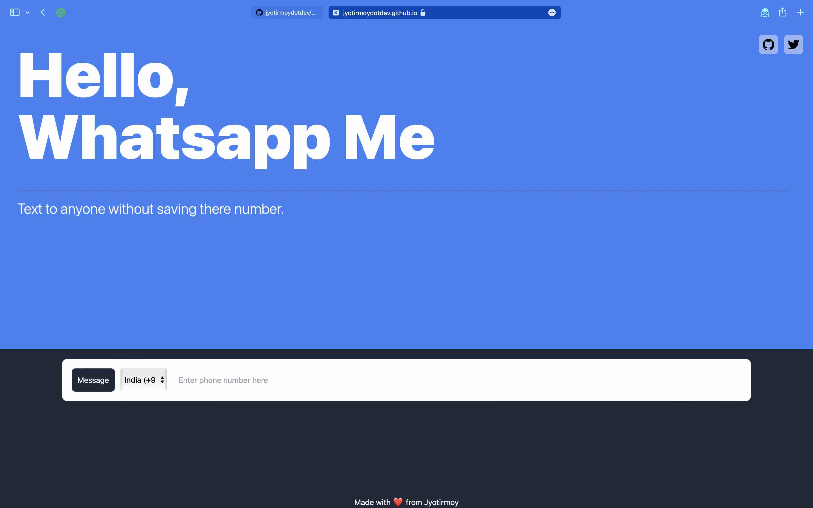

# [Whatsapp Me](https://jyotirmoydotdev.github.io/whatsappme/)

---
WhatsappMe is a convenient messaging tool that allows you to send messages to anyone without the need to save their phone number to your contacts. This is especially useful if you are in a hurry and do not have time to save the phone number before sending a message. With WhatsappMe, all you need to do is simply enter the recipient's phone number and click on the message button. You can stay in touch with your friends, family, and colleagues with ease using WhatsappMe. Whether you need to send a quick message or have a long chat, WhatsappMe has got you covered. So why not give it a try and see how it can make your life easier and more efficient? Download WhatsappMe and start messaging today!
WhatsappMe is a convenient messaging tool that allows you to send messages to anyone without the need to save their phone number to your contacts. This is especially useful if you are in a hurry and do not have time to save the phone number before sending a message. With WhatsappMe, all you need to do is simply enter the recipient's phone number and click on the message button. You can stay in touch with your friends, family, and colleagues with ease using WhatsappMe. Whether you need to send a quick message or have a long chat, WhatsappMe has got you covered. So why not give it a try and see how it can make your life easier and more efficient? Download WhatsappMe and start messaging today!

It can be the person to whom you want to just message but don't want to save.
It can be :
- Delivery guy
- Customer Care
- Any other person

# Development
For this project, I have used :

  

